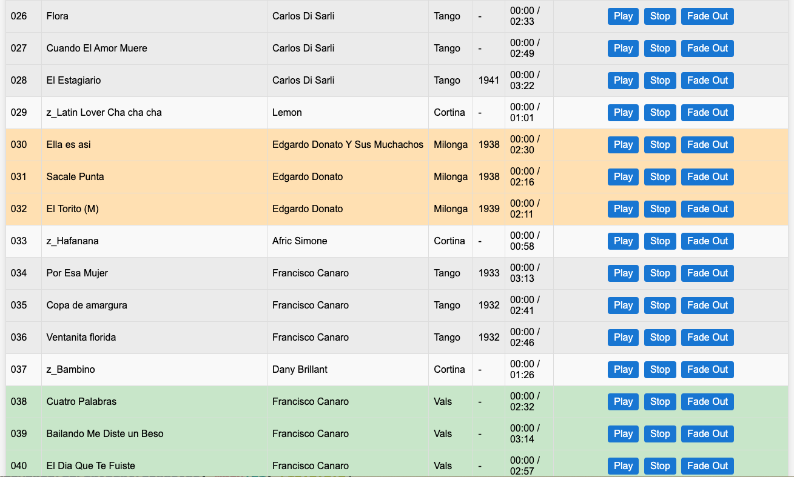

# 🎵 DJServer

**DJServer** is a lightweight, browser-based music player server designed to let you organize and play music tracks directly from a web interface. It's perfect for personal DJing, background music at events, or simply creating a portable music kiosk.

---

## ✨ Features



* 📁 Serves audio files from the local `music/` folder
* 🧠 Automatically extracts and displays metadata:

  * **Title**, **Artist**, **Genre**, **Year**, **Duration**
* 🔄 Dynamic playlist reload with a single click
* 🎚️ Smooth fade-out and stop controls for currently playing track
* 🔀 Reorder playlist interactively via drag-and-drop buttons
* 🎨 Highlights currently playing track and displays it prominently
* 🧮 Shows total duration of the playlist at the top
* 💾 Clean and portable — no external dependencies needed at runtime (uses embedded HTML via `embed`)

---

## 🚀 Getting Started

### 1. Prepare your music files

DJServer plays files located in the `music/` directory. You can manually copy files there or use the provided helper tool `copytracks` to extract tracks from an `.m3u` playlist exported from macOS Music or similar apps:

```bash
# copytracks - copies and renames files using playlist order and metadata
copytracks -playlistFile myplaylist.m3u -dst music
```

The tool ensures:

* File names are formatted as `### - Artist - Title.ext` (e.g., `001 - Carlos Di Sarli - La Cumparsita.mp3`)
* All referenced files are copied into the `music/` folder

---

### 2. Build and run DJServer

```bash
# Build (optional if you have precompiled binary)
make build

# Run DJServer
./DJServer -musicDir=./music

# Open the interface
http://localhost:8080
```

* Default port is `8080`. Use `-port` flag to change.
* Use `-musicDir` to specify a different folder for your music files.

---

## 📂 Project Structure

```
.
├── music/           # Folder for your music files
├── copytracks       # Helper tool to convert .m3u playlsits into music folder 
├── index.html       # Embedded UI
├── main.go          # DJServer implementation
├── Makefile         # Cross-platform build targets
├── README.md
```

---

## 🧪 Supported Formats

* MP3 (.mp3)
* MP4 (.mp4 / audio)
* AIFF (.aif / .aiff)
* Other audio formats supported via the [go-mp3/taglib](https://pkg.go.dev/github.com/dhowden/tag) library

---

## 🛠️ Building for Other Platforms

Use the included `Makefile` to build statically linked binaries for:

* Linux (amd64, arm64, ppc64le)
* macOS (amd64, arm64)
* Windows

```bash
make build-linux
make build-macos
make build-windows
```

---

## 📌 License

MIT License
